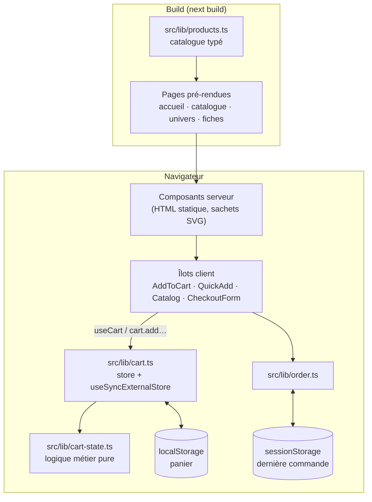

# CRAAK! — boutique de chips artisanales

[](https://github.com/TahirouM/ecommerce-chips/actions/workflows/ci.yml)

Boutique e-commerce de chips au design « pop » : catalogue, fiches produit, panier et tunnel de commande.

Next.js 16 (App Router) · React 19 · TypeScript · Tailwind CSS 4 · Vitest · Playwright

## Démarrer

```bash
nvm use          # Node 24
npm install
npm run dev      # http://localhost:3000
```

Scripts, workflow Git et conventions : voir **[CONTRIBUTING.md](CONTRIBUTING.md)**.

## Fonctionnalités

- Accueil : hero animé, bandeau défilant des saveurs, univers, produits mis en avant
- Catalogue : recherche, filtre par univers, tri (prix, note, niveau de piquant)
- Fiches produit pré-rendues : prix au kilo, niveau de piquant, état du stock
- Panier persistant, synchronisé entre onglets, plafonné au stock ; ajout rapide depuis les cartes
- Tunnel de commande : coordonnées, livraison (standard offerte dès 35 €), confirmation — **paiement en mode démo**

## Architecture



| Dossier           | Rôle                                                                                                     |
| ----------------- | -------------------------------------------------------------------------------------------------------- |
| `src/app/`        | Routes (App Router) : `/`, `/produits`, `/produits/[slug]`, `/categories/[slug]`, `/panier`, `/commande` |
| `src/components/` | Composants d'interface ; serveur par défaut, `"use client"` pour les îlots interactifs                   |
| `src/lib/`        | Données et logique métier, testées unitairement (`*.test.ts`)                                            |
| `e2e/`            | Tests de bout en bout Playwright                                                                         |
| `docs/adr/`       | Décisions d'architecture                                                                                 |

### Décisions d'architecture

| ADR                                                 | Décision                                                     |
| --------------------------------------------------- | ------------------------------------------------------------ |
| [0001](docs/adr/0001-nextjs-app-router-statique.md) | Next.js App Router, pages pré-rendues                        |
| [0002](docs/adr/0002-prix-en-centimes.md)           | Prix manipulés en centimes entiers                           |
| [0003](docs/adr/0003-etat-du-panier.md)             | Panier : store externe, `useSyncExternalStore`, localStorage |
| [0004](docs/adr/0004-visuels-svg.md)                | Visuels produits dessinés en SVG                             |
| [0005](docs/adr/0005-perimetre-demo.md)             | Périmètre démo : catalogue dans le code, pas de paiement     |
| [0006](docs/adr/0006-strategie-qualite.md)          | Stratégie qualité : conventions, tests, CI                   |
| [0007](docs/adr/0007-backend-simule.md)             | Backend simulé derrière une couche de services               |

## Qualité

| Niveau                                   | Outil                                | Quand               |
| ---------------------------------------- | ------------------------------------ | ------------------- |
| Formatage, lint, message de commit       | Prettier, ESLint, commitlint (Husky) | avant chaque commit |
| Tests unitaires et de composants         | Vitest, Testing Library              | chaque PR           |
| Tests de bout en bout (desktop + mobile) | Playwright                           | chaque PR           |
| Typage, build                            | TypeScript, `next build`             | chaque PR           |
| Mises à jour de dépendances              | Dependabot                           | chaque semaine      |

## Feuille de route

Suivie dans les [issues](https://github.com/TahirouM/ecommerce-chips/issues) et les [jalons](https://github.com/TahirouM/ecommerce-chips/milestones) :

- **M1 — Fondations qualité** : conventions, CI, tests, documentation d'architecture
- **M2 — Mise en production** : paiement Stripe, commandes et stock côté serveur, déploiement, audit d'accessibilité, back-office

## Personnaliser

- Saveurs, univers, frais de port : `src/lib/products.ts` (prix en centimes, poids en grammes)
- Couleurs et styles « pop » (boutons, ombres) : `src/app/globals.css`
