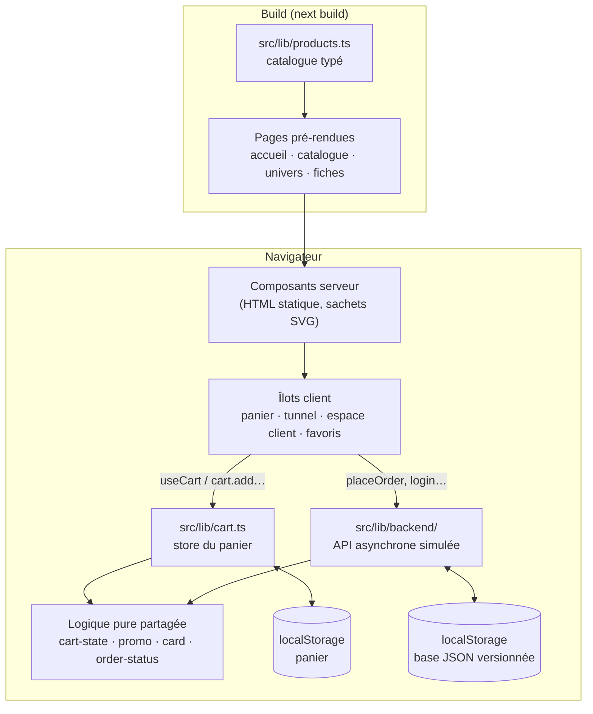

# CRAAK! — boutique de chips artisanales

[](https://github.com/TahirouM/ecommerce-chips/actions/workflows/ci.yml)

Boutique e-commerce de chips au design « pop », avec un **tunnel de vente complet simulé** : comptes clients, paiement par carte (3-D Secure compris), codes promo, suivi et annulation des commandes. Aucun paiement réel, aucun service tiers : tout tourne dans le navigateur derrière une couche « backend » interchangeable ([ADR 0007](docs/adr/0007-backend-simule.md)).

Next.js 16 (App Router) · React 19 · TypeScript · Tailwind CSS 4 · Vitest · Playwright

## Démarrer

```bash
nvm use          # Node 24
npm install
npm run dev      # http://localhost:3000
```

Scripts, workflow Git et conventions : voir **[CONTRIBUTING.md](CONTRIBUTING.md)**.

## Essayer la démo

| Quoi                    | Valeur                                                                                                  |
| ----------------------- | ------------------------------------------------------------------------------------------------------- |
| Compte de démonstration | `demo@craak.fr` / `chips2026` (adresses, favoris et 3 commandes déjà là)                                |
| Carte acceptée          | `4242 4242 4242 4242`, date future, CVC `123`                                                           |
| Carte avec 3-D Secure   | `4000 0027 6000 3184` (code de la banque : `123456`)                                                    |
| Cartes refusées         | `4000 0000 0000 0002` (refus) · `4000 0000 0000 9995` (fonds insuffisants)                              |
| Codes promo             | `BIENVENUE10` (−10 %) · `CRAAK5` (−5 € dès 20 €) · `LIVRAISON` (livraison offerte) · `ETE2026` (expiré) |
| Remise à zéro           | lien « Réinitialiser la démo » en pied de page                                                          |

Le statut d'une commande avance tout seul, en accéléré : préparation à 2 min, expédition à 5 min, livraison à 10 min.

## Fonctionnalités

**Boutique** : accueil animé, catalogue (recherche, filtres, tri par prix, note ou piquant), fiches pré-rendues avec **stock réel**, favoris (♡), panier persistant et synchronisé entre onglets.

**Comptes** : inscription, connexion, mot de passe oublié (e-mail simulé, lien à usage unique), profil, changement de mot de passe, suppression du compte, carnet d'adresses.

**Tunnel de commande** : identification (compte ou invité) → livraison (carnet ou saisie) → paiement par carte (validation, cartes de test, 3-D Secure) → confirmation. Code promo, livraison offerte dès 35 € (après remise), stock décrémenté.

**Après l'achat** : historique et détail des commandes, frise de suivi et n° de colis, annulation avant expédition (remboursement et remise en stock), facture imprimable, « commander à nouveau », suivi sans compte (n° + e-mail). Les commandes passées en invité rejoignent le compte créé avec le même e-mail.

## Architecture



| Dossier           | Rôle                                                                                                     |
| ----------------- | -------------------------------------------------------------------------------------------------------- |
| `src/app/`        | Routes (App Router) : `/`, `/produits`, `/produits/[slug]`, `/categories/[slug]`, `/panier`, `/commande` |
| `src/components/` | Composants d'interface ; serveur par défaut, `"use client"` pour les îlots interactifs                   |
| `src/lib/`        | Données et logique métier, testées unitairement (`*.test.ts`)                                            |
| `e2e/`            | Tests de bout en bout Playwright                                                                         |
| `docs/adr/`       | Décisions d'architecture                                                                                 |

### Décisions d'architecture

| ADR                                                 | Décision                                                     |
| --------------------------------------------------- | ------------------------------------------------------------ |
| [0001](docs/adr/0001-nextjs-app-router-statique.md) | Next.js App Router, pages pré-rendues                        |
| [0002](docs/adr/0002-prix-en-centimes.md)           | Prix manipulés en centimes entiers                           |
| [0003](docs/adr/0003-etat-du-panier.md)             | Panier : store externe, `useSyncExternalStore`, localStorage |
| [0004](docs/adr/0004-visuels-svg.md)                | Visuels produits dessinés en SVG                             |
| [0005](docs/adr/0005-perimetre-demo.md)             | Périmètre démo : catalogue dans le code, pas de paiement     |
| [0006](docs/adr/0006-strategie-qualite.md)          | Stratégie qualité : conventions, tests, CI                   |
| [0007](docs/adr/0007-backend-simule.md)             | Backend simulé derrière une couche de services               |

## Qualité

| Niveau                                   | Outil                                | Quand               |
| ---------------------------------------- | ------------------------------------ | ------------------- |
| Formatage, lint, message de commit       | Prettier, ESLint, commitlint (Husky) | avant chaque commit |
| Tests unitaires et de composants         | Vitest, Testing Library              | chaque PR           |
| Tests de bout en bout (desktop + mobile) | Playwright                           | chaque PR           |
| Typage, build                            | TypeScript, `next build`             | chaque PR           |
| Mises à jour de dépendances              | Dependabot                           | chaque semaine      |

## Feuille de route

Suivie dans les [issues](https://github.com/TahirouM/ecommerce-chips/issues) et les [jalons](https://github.com/TahirouM/ecommerce-chips/milestones) :

- **M1 — Fondations qualité** : conventions, CI, tests, documentation d'architecture
- **M2 — Mise en production** : paiement Stripe, commandes et stock côté serveur, déploiement, audit d'accessibilité, back-office

## Personnaliser

- Saveurs, univers, frais de port : `src/lib/products.ts` (prix en centimes, poids en grammes)
- Couleurs et styles « pop » (boutons, ombres) : `src/app/globals.css`
