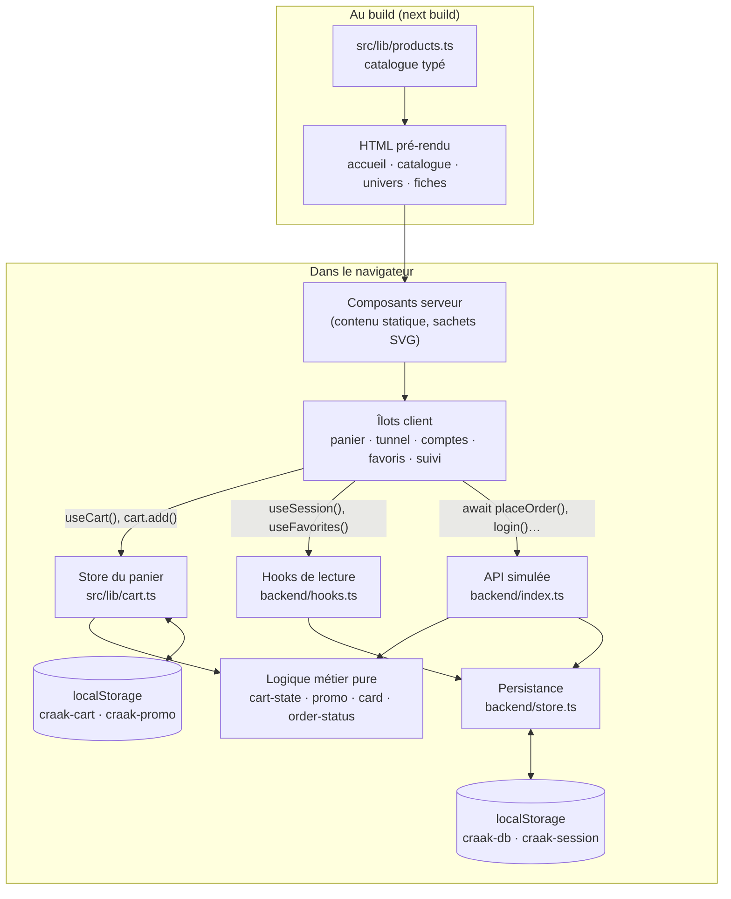
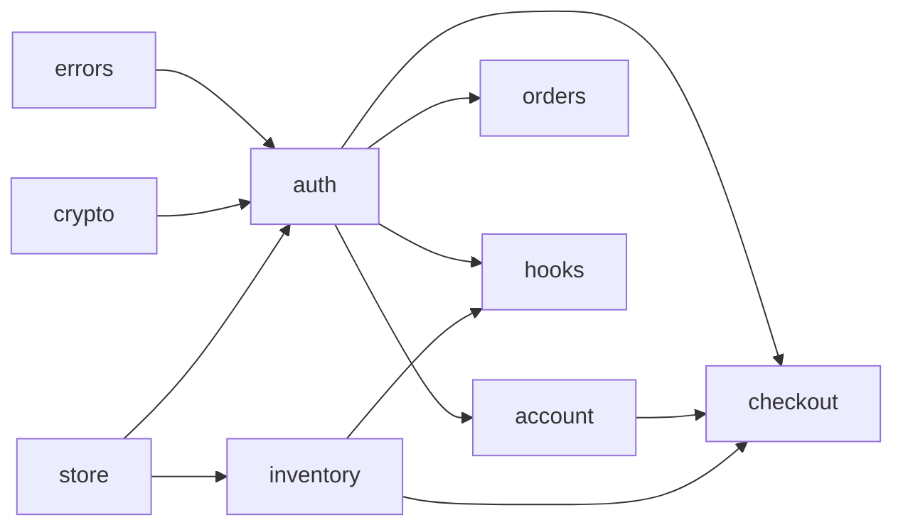
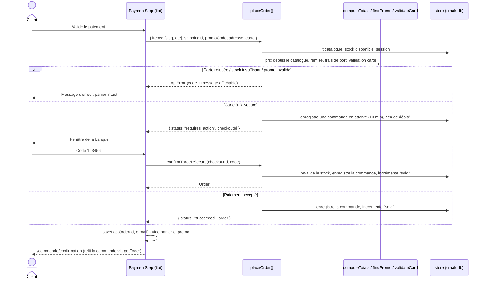

# 02 — Architecture

## 1. Contexte et contraintes

| Contrainte                                           | Conséquence sur l'architecture                                                                                               |
| ---------------------------------------------------- | ---------------------------------------------------------------------------------------------------------------------------- |
| Démo accessible à tous, sans compte tiers, sans coût | Pas de serveur applicatif ni de base de données : backend simulé dans le navigateur ([ADR 0007](adr/0007-backend-simule.md)) |
| Un vrai backend doit pouvoir être branché plus tard  | Une **couche de services** asynchrone et typée isole l'interface du stockage                                                 |
| Catalogue petit et stable, référencement important   | Pages produits **pré-rendues au build** ([ADR 0001](adr/0001-nextjs-app-router-statique.md))                                 |
| Calculs d'argent sans erreur d'arrondi               | Montants en **centimes entiers** partout ([ADR 0002](adr/0002-prix-en-centimes.md))                                          |
| Pas de photos produits disponibles                   | Visuels **générés en SVG** à partir des données ([ADR 0004](adr/0004-visuels-svg.md))                                        |
| Mobile prioritaire                                   | Tout écran est testé à 390 px, et les E2E tournent aussi sur un Pixel 7                                                      |

## 2. Vue d'ensemble



Le site est un **site statique enrichi** : le serveur Next.js ne fait qu'envoyer des fichiers pré-construits. Toute la logique dynamique s'exécute dans le navigateur, mais elle est organisée **comme si** un serveur existait.

## 3. Couches et règles de dépendance

```
 app/ (routes)          → minces : métadonnées, mise en page, choix serveur/client
   ↓
 components/            → affichage et interaction ; aucune règle métier
   ↓
 lib/backend/index.ts   → API : seule porte d'entrée vers les données
   ↓
 lib/backend/*.ts       → « serveur » : validation, autorisation, persistance
   ↓
 lib/*.ts (purs)        → règles métier sans React ni navigateur
```

**Règles :**

1. **Un composant n'importe jamais `backend/store.ts`, ni `localStorage` pour des données métier.** Il passe par `@/lib/backend` (actions) ou `@/lib/backend/hooks` (lectures réactives). C'est ce qui rend le backend remplaçable.
2. **La logique métier est pure et vit dans `src/lib/`.** Les fonctions de calcul (`computeTotals`, `findPromo`, `validateCard`, `orderStatus`…) ne dépendent ni de React ni du navigateur. Elles sont testées unitairement.
3. **Une même règle n'est écrite qu'une fois.** L'aperçu du panier et le backend appellent le même `computeTotals` : le montant affiché et le montant « débité » ne peuvent pas diverger.
4. **Le backend ne fait pas confiance au client.** Il reçoit des slugs et des quantités, jamais des prix. Il relit le catalogue, revalide le stock, le code promo et la carte, et recalcule le total.
5. **Pas de dépendance circulaire entre modules du backend.** `auth.ts` est la base ; `account.ts`, `checkout.ts` et `orders.ts` en dépendent, jamais l'inverse.



## 4. Stratégie de rendu

| Route                                                               | Rendu                             | Pourquoi                                                                           |
| ------------------------------------------------------------------- | --------------------------------- | ---------------------------------------------------------------------------------- |
| `/`, `/produits`                                                    | Statique                          | Contenu identique pour tous                                                        |
| `/produits/[slug]`, `/categories/[slug]`                            | Statique, `generateStaticParams`  | 16 fiches et 5 univers connus au build : HTML immédiat et bien référencé           |
| `/panier`, `/commande`, `/favoris`, `/compte/**`, `/suivi-commande` | Coquille statique + îlot client   | Contenu propre à chaque visiteur, lu dans le navigateur                            |
| `/connexion`, `/inscription`, `/compte/commandes/detail`            | Coquille + îlot sous `<Suspense>` | Lisent `useSearchParams()` (`?retour=`, `?id=`), qui impose une frontière Suspense |

`next.config.ts` active `cacheComponents` et `partialPrefetching` : la partie statique de chaque page est préchargée au survol des liens, et seule la partie client s'exécute après la navigation.

**Une fiche produit illustre bien le découpage :**

- **composants serveur** : la description, le prix et le visuel SVG (zéro JavaScript envoyé pour eux) ;
- **îlots client** : le stock réel (`<StockStatus>`), le bouton favori et l'ajout au panier.

Pendant l'hydratation, les îlots affichent une valeur « serveur » stable (stock du catalogue, aucun favori). Elle est ensuite remplacée par la valeur réelle du navigateur. Il n'y a pas d'erreur d'hydratation, car `useSyncExternalStore` reçoit un `getServerSnapshot` dédié.

## 5. Gestion de l'état

Il n'y a **aucune bibliothèque d'état** (ni Redux, ni Zustand, ni Context global). Trois mécanismes suffisent :

| État                                            | Où                         | Mécanisme                                                                       | Persistance                                            |
| ----------------------------------------------- | -------------------------- | ------------------------------------------------------------------------------- | ------------------------------------------------------ |
| Panier                                          | `src/lib/cart.ts`          | Store externe + `useSyncExternalStore` ([ADR 0003](adr/0003-etat-du-panier.md)) | `localStorage` `craak-cart`, synchronisé entre onglets |
| Code promo saisi                                | `src/lib/cart.ts`          | Idem                                                                            | `localStorage` `craak-promo`                           |
| Données « serveur » (comptes, commandes, stock) | `src/lib/backend/store.ts` | Document JSON en cache mémoire + abonnés ; hooks dans `hooks.ts`                | `localStorage` `craak-db` (versionné)                  |
| Session                                         | `src/lib/backend/store.ts` | Jeton opaque, séparé de la base (comme un cookie)                               | `localStorage` `craak-session`                         |
| Dernière commande passée                        | `src/lib/last-order.ts`    | Identifiant + e-mail seulement                                                  | `sessionStorage` (propre à l'onglet)                   |
| État d'écran (formulaire, étape du tunnel)      | Composant                  | `useState`                                                                      | Aucune                                                 |

**Pourquoi des stores externes plutôt qu'un Context :**

- ils sont lisibles hors de React, ce qui permet au backend de connaître le stock et au panier de le plafonner ;
- ils se synchronisent entre onglets grâce à l'évènement `storage` ;
- ils ne re-rendent que les composants abonnés.

**Mutation de la base** : `updateDb(mutate)` travaille sur un `structuredClone`, puis remplace le cache, persiste et notifie les abonnés. Chaque mutation produit une **nouvelle référence**, ce qui permet aux hooks de garder un instantané stable (une exigence de `useSyncExternalStore`).

## 6. Flux clés

### 6.1 Passer commande



Points d'attention :

- **Le stock est revérifié deux fois** : au moment du paiement, puis à la finalisation. Entre les deux, la validation 3-D Secure a pu laisser partir le dernier article.
- **La page de confirmation ne reçoit pas la commande en mémoire** : elle la relit depuis le backend. Un rechargement de la page fonctionne donc, et une vraie API n'aura rien à changer.

### 6.2 Connexion et retour à la page d'origine

1. `<RequireAuth>` constate `useSession() === null` et redirige vers `/connexion?retour=/compte/adresses`.
2. Après `login()`, le formulaire envoie vers `safeReturnTo(retour)`. Seul un chemin interne est accepté, ce qui empêche une redirection ouverte (voir [Sécurité](08-securite.md)).
3. `openSession()` :
   - fusionne les favoris du visiteur dans le compte ;
   - rattache les commandes passées en invité avec le même e-mail.

### 6.3 Statut d'une commande

Le statut n'est **pas stocké** : il est **dérivé** de `createdAt` et `cancelledAt` par `orderStatus(order, now)`. `useNow()` rafraîchit l'heure toutes les 15 s, ce qui fait avancer la frise sans aucune écriture. Une vraie API renverrait un statut stocké, et seul `orderStatus` serait à remplacer.

## 7. Choix techniques

| Choix                                               | Raison principale                                                                                                                       | Alternative écartée                                                |
| --------------------------------------------------- | --------------------------------------------------------------------------------------------------------------------------------------- | ------------------------------------------------------------------ |
| Next.js 16, App Router                              | Pré-rendu, composants serveur (moins de JS envoyé), routing par fichiers                                                                | SPA Vite : pas de HTML pré-rendu                                   |
| React 19                                            | `useSyncExternalStore`, `<dialog>` piloté, Actions                                                                                      | —                                                                  |
| TypeScript strict, sans `any`                       | Le compilateur vérifie les contrats entre l'interface et l'API (`CheckoutInput`, `Order`…)                                              | —                                                                  |
| Tailwind CSS 4                                      | Tokens dans `globals.css` (`@theme`), utilitaires `btn` et `shadow-pop` : un design system léger                                        | CSS Modules : plus de fichiers, tokens dupliqués                   |
| Aucune bibliothèque de formulaires ni de validation | Une dizaine de formulaires simples : `FormData` + fonctions de validation pures suffisent, et ces règles sont partagées avec le backend | react-hook-form + zod : dépendances de plus pour un besoin couvert |
| Web Crypto (PBKDF2)                                 | Hachage des mots de passe natif, sans dépendance                                                                                        | bcryptjs : dépendance de plus                                      |
| Aucune dépendance d'exécution hors Next et React    | Surface d'attaque et de maintenance minimale (voir `package.json`)                                                                      | —                                                                  |

## 8. Ce que l'architecture rend facile ou difficile

**Facile :**

- remplacer le backend : on réécrit les fonctions de `backend/*.ts`, sans toucher à leurs signatures ;
- ajouter une saveur : une entrée dans `products.ts`, et le visuel, la fiche, le stock et le référencement suivent ;
- tester : la logique est pure, et le backend tourne en mémoire sous jsdom.

**Difficile ou impossible tant que le backend est simulé** (voir [Feuille de route](10-feuille-de-route.md)) :

- partager des données entre navigateurs ou appareils ;
- garantir la sécurité : le client contrôle tout son `localStorage` ;
- mettre en place un back-office ou des statistiques globales.
