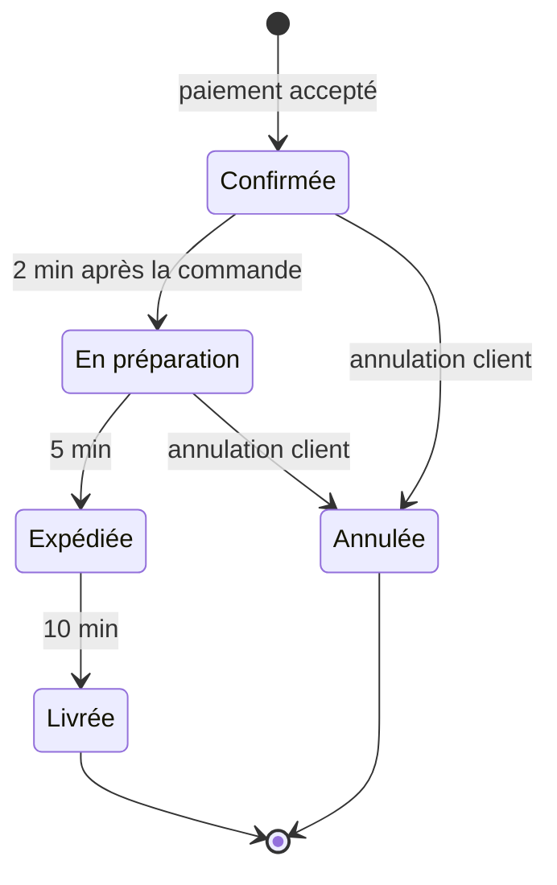

# 03 — Règles métier

Chaque règle renvoie au fichier qui fait foi et au test qui la verrouille. Si cette page et le code divergent, **c'est le code qui a raison** : corrigez la page.

## 1. Catalogue

_Source : `src/lib/products.ts`_

- **16 produits** répartis en **5 univers** : classiques, relevées, gourmandes, légères, packs.
- Un produit a un `slug` unique (qui sert d'identifiant partout), un prix en **centimes**, un éventuel prix barré (`compareAtPrice`), un poids en **grammes**, un niveau de piquant de 0 à 3 (`Douce` → `Extrême`), une note, et un **stock initial**.
- Cas de démonstration : `poulet-roti` a un stock de 0 (épuisé), et `habanero-extreme` un stock de 6 (stock faible).
- Le prix au kilo est calculé, jamais saisi : `pricePerKg`.
- Le catalogue est dans le code (versionné, relu en PR). Il passera en base avec le back-office (#10).

## 2. Montants

_Source : [ADR 0002](adr/0002-prix-en-centimes.md), `formatPrice`_

- **Tous les montants sont des entiers en centimes**, du catalogue jusqu'à la commande enregistrée.
- Ils ne sont convertis en euros qu'à l'affichage, par `formatPrice` (`Intl.NumberFormat("fr-FR")`).
- Les pourcentages sont arrondis au centime le plus proche (`Math.round`).

## 3. Panier

_Source : `src/lib/cart-state.ts` · tests : `cart-state.test.ts`_

- Le panier est une liste de `{ slug, quantity }`. Il ne contient **jamais de prix** : les prix sont toujours relus dans le catalogue.
- **La quantité est plafonnée au stock disponible.** Ajouter au-delà ramène au maximum, et une quantité de 0 retire la ligne.
- Un produit épuisé ne peut pas être ajouté. Le bouton est désactivé, et `addItem` renvoie le panier inchangé.
- Au rechargement, les produits qui n'existent plus dans le catalogue sont écartés silencieusement (`parseCart`).
- Le panier est conservé entre les visites et **synchronisé entre onglets**.
- Le panier est vidé uniquement **après une commande réussie** : un paiement refusé le laisse intact.

## 4. Livraison

_Source : `SHIPPING_OPTIONS`, `shippingCost`, `computeTotals`_

| Mode     | Prix   | Délai annoncé |
| -------- | ------ | ------------- |
| Standard | 4,90 € | 2 à 4 jours   |
| Express  | 8,90 € | 24 h          |

- **La livraison standard est offerte dès 35 € d'achat.** Ce seuil s'apprécie **après remise** : 36 € avec −10 % donnent 32,40 €, et la livraison redevient payante.
- **La livraison express reste payante**, même au-delà de 35 €.
- Le code `LIVRAISON` rend gratuits les deux modes.
- Seules les adresses en France métropolitaine sont acceptées : code postal à 5 chiffres, téléphone français facultatif (`addressProblem`).

## 5. Codes promo

_Source : `src/lib/promo.ts` · tests : `promo.test.ts`_

| Code          | Effet               | Condition                   |
| ------------- | ------------------- | --------------------------- |
| `BIENVENUE10` | −10 % du sous-total | —                           |
| `CRAAK5`      | −5 €                | Sous-total ≥ 20 €           |
| `LIVRAISON`   | Livraison offerte   | —                           |
| `ETE2026`     | −15 %               | Expiré depuis le 01/09/2026 |

- Un seul code par commande. La saisie ignore la casse et les espaces.
- **La remise ne dépasse jamais le sous-total** : une commande n'est jamais négative.
- Le code saisi dans le panier n'est qu'une **préférence du client**. Le backend le **revalide** au moment du paiement, avec le sous-total recalculé. S'il n'est plus valable (par exemple, le panier est passé sous 20 €), la commande est refusée avec un message explicite (`invalid_promo`).
- Ordre de calcul : `sous-total − remise + livraison(sous-total − remise)` = `total`.

## 6. Stock

_Source : `backend/inventory.ts`_

- **Stock disponible = stock du catalogue − quantités vendues** (`db.sold`). Il est affiché sur la fiche produit en trois paliers : en stock (10 et plus), « Plus que N » (moins de 10), épuisé (0).
- Le stock est **vérifié par le backend** au moment du paiement, puis **une seconde fois** à la finalisation (après 3-D Secure).
- Une commande **décrémente** le stock. Une annulation le **restitue**.
- Une commande en attente de 3-D Secure **ne réserve pas** de stock. Si le dernier article part pendant l'authentification, la finalisation échoue avec `out_of_stock`, et rien n'est débité.
- Les 3 commandes du compte de démonstration sont historiques : elles n'entament pas le stock (`sold` est vide dans le seed).

## 7. Paiement

_Source : `src/lib/card.ts`, `backend/checkout.ts` · tests : `card.test.ts`, `checkout.test.ts`_

Validation de la carte (les mêmes règles côté interface et côté backend) :

- nom obligatoire ;
- numéro valide selon l'algorithme de **Luhn** (12 à 19 chiffres) ;
- expiration au format `MM/AA` et non dépassée ; la carte est valable jusqu'au dernier jour du mois indiqué ;
- CVC de 3 chiffres, ou 4 pour American Express ;
- la marque (Visa, Mastercard, Amex) est déduite du numéro.

L'issue du paiement est choisie par le numéro de carte, sur le même principe que Stripe :

| Carte                    | Issue                                       |
| ------------------------ | ------------------------------------------- |
| `4242 4242 4242 4242`    | Acceptée                                    |
| `4000 0027 6000 3184`    | Authentification 3-D Secure (code `123456`) |
| `4000 0000 0000 0002`    | Refusée par la banque                       |
| `4000 0000 0000 9995`    | Fonds insuffisants                          |
| Toute autre carte valide | Acceptée                                    |

Règles 3-D Secure :

- la session d'authentification dure **10 minutes** ;
- un mauvais code laisse la commande en attente, et le client peut réessayer ;
- fermer la fenêtre annule la commande en attente ;
- **rien n'est enregistré ni débité avant la validation**.

La commande ne conserve que la **marque et les 4 derniers chiffres** de la carte.

## 8. Cycle de vie d'une commande

_Source : `src/lib/order-status.ts` · tests : `order-status.test.ts`_

- Les délais sont **accélérés pour la démo** : quelques minutes au lieu de quelques jours.
- Le statut est **calculé**, pas stocké (voir [Architecture §6.3](02-architecture.md#63-statut-dune-commande)).
- **Annulation possible tant que le colis n'est pas parti** (`Confirmée` ou `En préparation`). Elle rembourse (de façon simulée) et restitue le stock. Elle est refusée ensuite (`not_cancellable`).
- Chaque commande reçoit un numéro `CRK-…` et un numéro de colis `6A…` (format Colissimo), affiché à partir de l'expédition.
- Une commande est **immuable** une fois passée. Ses lignes gardent le nom et le prix **au moment de l'achat**, même si le catalogue change ensuite.
- « Commander à nouveau » remet les articles au panier aux **prix actuels**, dans la limite du stock disponible.

## 9. Comptes clients

_Source : `backend/auth.ts`, `backend/account.ts` · tests : `auth.test.ts`, `account.test.ts`_

| Règle                      | Détail                                                                                                                                                                                   |
| -------------------------- | ---------------------------------------------------------------------------------------------------------------------------------------------------------------------------------------- |
| Identifiant                | E-mail, normalisé (sans espaces, en minuscules), unique                                                                                                                                  |
| Mot de passe               | 8 caractères minimum, dont au moins une lettre et un chiffre                                                                                                                             |
| Connexion échouée          | Toujours le même message, que l'e-mail existe ou non                                                                                                                                     |
| Mot de passe oublié        | Lien à usage unique, valable 30 min. Une nouvelle demande invalide la précédente. L'utilisation du lien ferme toutes les sessions.                                                       |
| Changement de mot de passe | Le mot de passe actuel est exigé                                                                                                                                                         |
| Suppression du compte      | Mot de passe exigé. Le compte, ses sessions et ses jetons sont supprimés. Les commandes sont **conservées** (obligation comptable) mais ne sont plus rattachées à un compte connectable. |
| Carnet d'adresses          | La première adresse devient l'adresse par défaut, et il y en a toujours une tant que le carnet n'est pas vide                                                                            |
| Achat invité               | Possible, avec un e-mail. Les commandes rejoignent le compte créé ensuite avec le même e-mail.                                                                                           |
| Favoris                    | Possibles sans compte. Ils sont fusionnés dans le compte à la connexion.                                                                                                                 |
| Accès à une commande       | Le client connecté qui l'a passée, **ou** toute personne qui fournit le numéro **et** l'e-mail de la commande (comme un suivi de colis)                                                  |

## 10. Glossaire

| Terme métier        | Dans le code            | Définition                                                                |
| ------------------- | ----------------------- | ------------------------------------------------------------------------- |
| Saveur, produit     | `Product`, `slug`       | Un article du catalogue                                                   |
| Univers             | `Category`              | Une famille de saveurs                                                    |
| Ligne de panier     | `CartItem` / `CartLine` | Un produit et sa quantité (`CartLine` y ajoute le produit et le total)    |
| Ligne de commande   | `OrderLine`             | Un produit figé au prix payé                                              |
| Sous-total          | `subtotal`              | Somme des lignes, avant remise et livraison                               |
| Remise              | `discount`              | Montant retiré par un code promo                                          |
| Tunnel de commande  | `/commande`, `Checkout` | Identification → Livraison → Paiement                                     |
| Commande en attente | `PendingCheckout`       | Commande dont la validation 3-D Secure n'est pas terminée                 |
| Vendu               | `db.sold`               | Quantités vendues par produit, qui servent à calculer le stock disponible |
| Invité              | `userId: null`          | Client qui commande sans compte                                           |
| Visiteur            | `guestFavorites`        | Personne non connectée qui navigue                                        |
