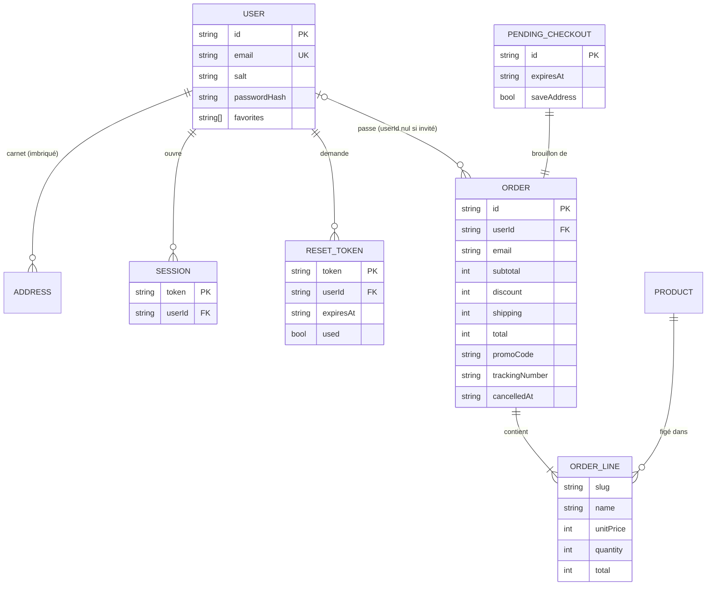

# 04 — API du backend

Référence de l'API exposée par `src/lib/backend/index.ts`. C'est le **contrat** entre l'interface et le serveur. Aujourd'hui le serveur est simulé ([ADR 0007](adr/0007-backend-simule.md)). Demain, chaque fonction deviendra un appel HTTP, **avec la même signature**.

## 1. Principes du contrat

| Principe                 | En pratique                                                                                                    |
| ------------------------ | -------------------------------------------------------------------------------------------------------------- |
| Asynchrone               | Toute action renvoie une `Promise` et prend 200 à 500 ms (`network()`), sauf en test, où elle est immédiate    |
| Erreurs typées           | Un échec métier lève une `ApiError { code, message }`. Le `message` peut être montré tel quel à l'utilisateur. |
| Pas de données sensibles | Le client ne reçoit jamais de hash ni de sel (`PublicUser`), ni de numéro de carte complet                     |
| Copies défensives        | Les objets renvoyés sont des copies (`structuredClone`) : les modifier ne modifie pas la base                  |
| Session implicite        | L'utilisateur courant est déduit du jeton de session, comme avec un cookie. On ne passe jamais d'`userId`.     |
| Le serveur fait foi      | Prix, remise, frais de port, stock et validité de la carte sont recalculés côté backend                        |

## 2. Utilisation depuis un composant

```tsx
"use client";
import { login } from "@/lib/backend";
import { useAsyncAction } from "@/lib/use-async-action";

function LoginForm() {
  const { pending, error, run } = useAsyncAction();
  async function onSubmit(data: FormData) {
    const user = await run(() => login({ email: String(data.get("email")), password: String(data.get("password")) }));
    if (user) router.push(returnTo); // undefined si erreur : `error` contient alors le message
  }
  // … <FormError>{error}</FormError> <SubmitButton pending={pending}>…
}
```

`useAsyncAction` gère l'indicateur de chargement et la traduction d'une erreur en message (`errorMessage`). Une erreur inattendue (un bug, et non une `ApiError`) donne un message générique, sans détail technique.

## 3. Authentification — `auth.ts`

| Fonction                                             | Accès  | Renvoie                                                | Erreurs                                                            |
| ---------------------------------------------------- | ------ | ------------------------------------------------------ | ------------------------------------------------------------------ |
| `register({ email, password, firstName, lastName })` | Public | `PublicUser`, et ouvre une session                     | `invalid_input`, `weak_password`, `email_taken`                    |
| `login({ email, password })`                         | Public | `PublicUser`, et ouvre une session                     | `invalid_credentials` (même message que l'e-mail existe ou non)    |
| `logout()`                                           | Public | `void`                                                 | —                                                                  |
| `requestPasswordReset(email)`                        | Public | `{ simulatedEmail: { to, firstName, token } \| null }` | — (même réponse que le compte existe ou non)                       |
| `resetPassword(token, password)`                     | Public | `void`, et ferme toutes les sessions du compte         | `weak_password`, `invalid_token` (inconnu, déjà utilisé ou expiré) |

Validation pure, réutilisable dans les formulaires : `isValidEmail(email)`, `passwordProblem(password) → string | null`.

> `simulatedEmail` n'existe que pour la démo : il représente l'e-mail que le client aurait reçu, et l'interface l'affiche. Avec une vraie API, la réponse sera vide et l'e-mail partira par un service d'envoi.

Effets de bord de l'ouverture de session (`register` et `login`) :

- les favoris du visiteur sont fusionnés dans le compte ;
- les commandes invité passées avec le même e-mail sont rattachées au compte.

## 4. Compte — `account.ts`

Toutes ces fonctions exigent une session (`unauthorized` sinon), sauf `toggleFavorite`.

| Fonction                                                                                         | Renvoie                                                  | Erreurs                                |
| ------------------------------------------------------------------------------------------------ | -------------------------------------------------------- | -------------------------------------- |
| `updateProfile({ firstName, lastName, email })`                                                  | `PublicUser`                                             | `invalid_input`, `email_taken`         |
| `changePassword(current, next)`                                                                  | `void`                                                   | `invalid_credentials`, `weak_password` |
| `deleteAccount(password)`                                                                        | `void`, et ferme la session                              | `invalid_credentials`                  |
| `saveAddress({ id?, label, firstName, lastName, line1, line2?, zip, city, phone?, isDefault? })` | `Address` (crée sans `id`, modifie avec)                 | `invalid_input`, `not_found`           |
| `deleteAddress(id)`                                                                              | `void`                                                   | —                                      |
| `setDefaultAddress(id)`                                                                          | `void`                                                   | `not_found`                            |
| `toggleFavorite(slug)`                                                                           | `void`, **synchrone** (le cœur doit réagir sans latence) | `not_found`                            |

Validation pure : `addressProblem(address) → string | null`.

## 5. Commande et paiement — `checkout.ts`

### `placeOrder(input: CheckoutInput): Promise<CheckoutResult>`

```ts
type CheckoutInput = {
  items: { slug: string; quantity: number }[]; // jamais de prix
  shippingId: "standard" | "express";
  promoCode: string | null;
  email?: string; // obligatoire pour un invité ; ignoré si connecté
  address: { addressId: string } | ShippingAddress; // carnet ou saisie
  saveAddress?: boolean; // ajoute l'adresse saisie au carnet (client connecté)
  card: { name: string; number: string; expiry: string; cvc: string };
};

type CheckoutResult = { status: "succeeded"; order: Order } | { status: "requires_action"; checkoutId: string }; // 3-D Secure à valider
```

Ordre des vérifications, chacune pouvant interrompre la commande :

1. e-mail valide → `invalid_input` ;
2. panier non vide, produits existants, quantités entières ≥ 1 → `invalid_input` / `not_found` ;
3. stock suffisant → `out_of_stock` (le message précise le produit et le stock restant) ;
4. adresse du carnet existante, ou adresse saisie valide → `not_found` / `invalid_input` ;
5. code promo valide pour le sous-total recalculé → `invalid_promo` ;
6. carte valide → `invalid_input` ;
7. réponse de la « banque » → `payment_failed`, ou demande de 3-D Secure.

### `confirmThreeDSecure(checkoutId, code): Promise<Order>`

Finalise une commande en attente. Erreurs possibles :

- `invalid_token` : la session de paiement a expiré (10 min) ;
- `payment_failed` : mauvais code ; la commande reste en attente et le client peut réessayer ;
- `out_of_stock` : le stock est parti entre-temps.

### `cancelThreeDSecure(checkoutId): Promise<void>`

Oublie la commande en attente. Rien n'avait été débité.

### `getOrder(id, email?): Promise<Order>`

Renvoie la commande si le client connecté en est le titulaire, **ou** si `email` correspond à celui de la commande. Le numéro est normalisé (espaces, casse). Erreur : `not_found`, **même message** que la commande existe ou non.

## 6. Commandes — `orders.ts`

| Fonction                  | Accès                               | Renvoie                                          | Erreurs                        |
| ------------------------- | ----------------------------------- | ------------------------------------------------ | ------------------------------ |
| `listMyOrders()`          | Session                             | `Order[]`, de la plus récente à la plus ancienne | `unauthorized`                 |
| `cancelOrder(id, email?)` | Titulaire, ou e-mail de la commande | `Order` annulée ; stock restitué                 | `not_found`, `not_cancellable` |

## 7. Stock — `inventory.ts`

`availableStock(slug) → number` : lecture synchrone, utilisée par le store du panier pour plafonner les quantités.

## 8. Hooks de lecture — `hooks.ts`

À importer depuis `@/lib/backend/hooks` (fichier client). Ils se mettent à jour à chaque écriture en base, y compris depuis un autre onglet.

| Hook                      | Renvoie                                       | Pendant le rendu serveur et l'hydratation |
| ------------------------- | --------------------------------------------- | ----------------------------------------- |
| `useSession()`            | `PublicUser` ou `null` (personne de connecté) | `undefined` (« on ne sait pas encore »)   |
| `useFavorites()`          | `string[]` (slugs)                            | `[]`                                      |
| `useAvailableStock(slug)` | `number`                                      | Stock du catalogue                        |

**Toujours distinguer `undefined` de `null`** pour la session : rediriger vers la connexion sur `undefined` renverrait à tort un client connecté vers `/connexion` pendant l'hydratation (voir `RequireAuth`).

## 9. Codes d'erreur

| Code                  | Signification                                           | Statut HTTP équivalent (future API) |
| --------------------- | ------------------------------------------------------- | ----------------------------------- |
| `invalid_input`       | Donnée manquante ou mal formée                          | 400 / 422                           |
| `weak_password`       | Mot de passe trop faible                                | 422                                 |
| `invalid_credentials` | Identifiants ou mot de passe actuel incorrects          | 401                                 |
| `unauthorized`        | Session absente ou expirée                              | 401                                 |
| `email_taken`         | E-mail déjà utilisé                                     | 409                                 |
| `not_found`           | Ressource inexistante **ou non accessible**             | 404                                 |
| `invalid_token`       | Lien de réinitialisation ou session 3-D Secure invalide | 410                                 |
| `out_of_stock`        | Stock insuffisant                                       | 409                                 |
| `invalid_promo`       | Code promo inconnu, expiré ou non applicable            | 422                                 |
| `payment_failed`      | Paiement refusé                                         | 402                                 |
| `not_cancellable`     | Commande déjà expédiée ou annulée                       | 409                                 |

Ajouter un code : l'ajouter à `ApiErrorCode` (`errors.ts`), puis à ce tableau.

## 10. Modèle de données

_Source : `backend/types.ts`_



Le document `Db` contient aussi :

- `guestFavorites`, les favoris du visiteur non connecté ;
- `sold: Record<slug, number>`, les quantités vendues par produit.

Identifiants :

| Préfixe | Ressource                               |
| ------- | --------------------------------------- |
| `usr_`  | Utilisateur                             |
| `adr_`  | Adresse                                 |
| `chk_`  | Paiement en attente                     |
| `CRK-…` | Commande (horodatage en base 36 + aléa) |
| `6A…`   | Numéro de colis                         |

## 11. Persistance et versionnage

_Source : `backend/store.ts`_

| Clé `localStorage` | Contenu                                        |
| ------------------ | ---------------------------------------------- |
| `craak-db`         | Document `Db` complet, avec un champ `version` |
| `craak-session`    | Jeton de session courant                       |

Règles :

- **Toute modification de la forme de `Db` impose d'incrémenter `DB_VERSION`** (actuellement 4). Une base d'une autre version est ignorée et la démo repart du seed : c'est une « migration » destructive, acceptable pour une démo. La procédure est dans [Exploitation](09-exploitation.md#2-faire-évoluer-le-modèle-de-données).
- Les écritures passent toutes par `updateDb(mutate)` : copie, mutation, persistance, puis notification des abonnés. Une `ApiError` levée dans `mutate` annule l'écriture.
- Une erreur d'accès au `localStorage` (navigation privée, quota dépassé) est silencieuse : la démo continue en mémoire.

## 12. Ajouter une fonction à l'API

1. Écrire la fonction dans le module concerné (`account.ts`, `orders.ts`…) :
   - commencer par `await network()` ;
   - puis `requireUser()` si l'action est réservée à un client connecté ;
   - valider toutes les entrées et lever des `ApiError` ;
   - écrire via `updateDb` et renvoyer une copie.
2. L'exporter depuis `index.ts`. **Une fonction non exportée n'existe pas pour l'interface.**
3. La tester dans `<module>.test.ts` : le cas nominal, chaque erreur, et les droits d'accès (« un autre client ne peut pas… »).
4. Documenter la fonction ici.
