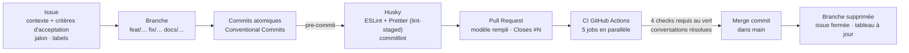

# 07 — Industrialisation

Comment le code passe du poste d'un développeur à `main`, et ce qui garantit qu'il n'y arrive pas cassé. Le guide pratique pour contribuer est [CONTRIBUTING.md](../CONTRIBUTING.md) ; cette page en donne la vue d'ensemble et les raisons.

## 1. Du ticket à la fusion



## 2. Garde-fous, du plus rapide au plus complet

| Où             | Quoi                                                                                                       | Temps de retour |
| -------------- | ---------------------------------------------------------------------------------------------------------- | --------------- |
| Éditeur        | TypeScript, ESLint, Prettier (si l'intégration est activée)                                                | Immédiat        |
| `git commit`   | `lint-staged` : `eslint --fix` + `prettier --write` sur les fichiers indexés ; `commitlint` sur le message | ~3 s            |
| Pull Request   | CI complète                                                                                                | ~2–3 min        |
| Fusion         | Protection de branche                                                                                      | —               |
| Chaque semaine | Dependabot                                                                                                 | —               |

## 3. Pipeline CI

_Source : `.github/workflows/ci.yml`_

| Job                                | Étapes                                                                  | Requis pour fusionner       |
| ---------------------------------- | ----------------------------------------------------------------------- | --------------------------- |
| **Qualité (format, lint, typage)** | `format:check`, `lint`, `typecheck` (`next typegen && tsc`)             | ✅                          |
| **Tests unitaires**                | `npm test`                                                              | ✅                          |
| **Build**                          | `next build`                                                            | ✅                          |
| **Tests E2E (Playwright)**         | build, puis Playwright desktop + mobile ; rapport publié en cas d'échec | ✅                          |
| Messages de commit                 | `commitlint` sur tous les commits de la PR (sauf Dependabot)            | — (déjà vérifié localement) |

Choix de conception :

- **Jobs parallèles et indépendants** : un échec de lint n'empêche pas de connaître le résultat des tests. Le temps total est celui du job le plus lent (les E2E).
- **`concurrency` avec `cancel-in-progress`** : une nouvelle poussée annule le run précédent de la même branche.
- **`npm ci` et `cache: npm`** : installation reproductible depuis le `package-lock.json`.
- **Version de Node lue dans `.nvmrc`** : la CI et les postes utilisent la même version.
- **`permissions: contents: read`** : le jeton de la CI ne peut rien modifier dans le dépôt.
- **Timeouts sur chaque job** : un test bloqué ne consomme pas des heures de CI.
- `typecheck` lance d'abord `next typegen`. Les types de routes (`PageProps<"/produits/[slug]">`) sont générés : sans cette étape, la CI échouait sur un checkout propre alors que tout passait en local (voir l'ADR 0006).

## 4. Protection de `main`

| Règle                                  | Valeur                  | Pourquoi                                                                                                                                                   |
| -------------------------------------- | ----------------------- | ---------------------------------------------------------------------------------------------------------------------------------------------------------- |
| Pull Request obligatoire               | Oui                     | Aucune poussée directe, même pour le lead                                                                                                                  |
| Checks requis                          | Les 4 jobs ci-dessus    | Rien de rouge n'entre dans `main`                                                                                                                          |
| Branche à jour avant fusion (`strict`) | Oui                     | Les checks portent sur le code réellement fusionné                                                                                                         |
| Conversations résolues                 | Oui                     | Aucune remarque de relecture oubliée                                                                                                                       |
| S'applique aux administrateurs         | Oui                     | Le lead suit les mêmes règles que l'équipe                                                                                                                 |
| Approbations requises                  | 0 aujourd'hui           | GitHub interdit d'approuver sa propre PR, et l'équipe compte une personne. **À passer à 1 dès l'arrivée d'un second développeur** (`CODEOWNERS` est prêt). |
| Méthode de fusion                      | Merge commit uniquement | Conserve les commits atomiques et leurs hashes (`.git-blame-ignore-revs`, `git bisect`)                                                                    |
| Suppression de la branche après fusion | Automatique             | Pas de branches mortes                                                                                                                                     |

## 5. Discipline des commits

- **Conventional Commits**, en français : `feat:`, `fix:`, `test:`, `docs:`, `refactor:`, `chore:`, `ci:`… (`commitlint.config.mjs`).
- **Chaque commit compile et passe les tests.** Une branche est relue commit par commit, et `git bisect` doit rester utilisable sur `main`. Avant d'ouvrir une PR de plusieurs commits, on peut le vérifier ainsi :

  ```bash
  git rebase --exec "npm run typecheck && npm test" origin/main
  ```

- Le reformatage de masse est isolé dans son propre commit, référencé dans `.git-blame-ignore-revs`, pour que `git blame` désigne toujours l'auteur réel d'une ligne :

  ```bash
  git config blame.ignoreRevsFile .git-blame-ignore-revs   # une fois par poste
  ```

## 6. Gestion des dépendances

_Source : `.github/dependabot.yml`_

- **npm, chaque lundi** :
  - `next`, `react` et leurs types arrivent en une seule PR (`next-react`), car ils évoluent ensemble ;
  - toutes les autres mises à jour mineures et correctives sont regroupées dans une PR (`mineures`) ;
  - les versions majeures arrivent une par une, pour être évaluées séparément.
- **GitHub Actions, chaque mois.**
- **Une PR Dependabot suit les mêmes règles qu'une autre** : la CI doit passer. Une majeure qui casse le build est **refusée et documentée**, jamais forcée. Exemples :
  - TypeScript 7 est incompatible avec `typescript-eslint` : la PR a été refusée et l'issue #21 suit la migration ;
  - `@types/node` 26 ne correspond pas à Node 24 : les majeures de `@types/node` sont ignorées dans la configuration de Dependabot.
- **Aucune dépendance d'exécution** en dehors de `next`, `react` et `react-dom`. Ajouter une dépendance de production se justifie dans la PR, et dans un ADR si elle structure le projet.

## 7. Gestion de projet

- **Issues** créées depuis des modèles (`.github/ISSUE_TEMPLATE/` : bug, fonctionnalité). Une issue décrit le contexte et des **critères d'acceptation vérifiables**. Les issues vierges sont désactivées (`config.yml`) : tout ticket passe par un modèle.
- **Labels** sur trois axes :
  - type : `type: feature`, `type: bug`, `type: qualité`, `type: tests`, `type: ci/cd`, `type: docs` ;
  - priorité : `priorité: haute`, `priorité: moyenne`, `priorité: basse` ;
  - taille : `taille: S`, `taille: M`, `taille: L`.
- **Jalons** :
  - M1 — Fondations qualité (terminé) ;
  - M2 — Mise en production (en cours) ;
  - M3 — Tunnel de vente complet simulé (terminé).
- **Tableau GitHub Projects** : colonnes « À faire », « En cours » et « Terminé ». Une issue passe à « Terminé » à la fusion de la PR qui la ferme.
- **Une PR = une issue** (ou une partie cohérente d'une issue). Les PR empilées sont reciblées vers `main` avant la fusion de leur base, pour qu'elles ne soient pas fermées automatiquement.

## 8. Livraison

Le projet n'est pas encore déployé automatiquement. Le déploiement Vercel avec des environnements de prévisualisation par PR est suivi dans #7. Le modèle cible :

| Évènement          | Environnement                                             |
| ------------------ | --------------------------------------------------------- |
| PR ouverte         | Déploiement de prévisualisation, lien commenté dans la PR |
| Fusion dans `main` | Production                                                |
| Incident           | Retour arrière instantané vers le déploiement précédent   |

Comme tout est statique, le déploiement ne demande ni variable d'environnement ni migration.
