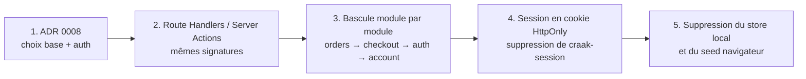

# 10 — Feuille de route et dette technique

## 1. Où en est le projet

| Jalon                                     | Contenu                                                                                                                   | État        |
| ----------------------------------------- | ------------------------------------------------------------------------------------------------------------------------- | ----------- |
| **M1 — Fondations qualité**               | Conventions, hooks Git, CI, tests unitaires et E2E, ADR, protection de branche                                            | ✅ Terminé  |
| **M3 — Tunnel de vente complet (simulé)** | Comptes, espace client, tunnel en 3 étapes, paiement et 3-D Secure, codes promo, stock, suivi et annulation des commandes | ✅ Terminé  |
| **M2 — Mise en production**               | Vrai backend, vrai paiement, déploiement, audit, back-office                                                              | 🔜 En cours |

M3 a été mené avant M2 pour **figer le contrat de l'API et les parcours avec une simulation**, avant d'investir dans l'infrastructure. Les écrans, les règles métier et les tests E2E sont prêts. M2 consiste à remplacer l'implémentation, pas à la concevoir.

## 2. Backlog priorisé

| Priorité | Issue | Sujet                                        | Taille | Dépend de | Pourquoi maintenant                                                                              |
| -------- | ----- | -------------------------------------------- | ------ | --------- | ------------------------------------------------------------------------------------------------ |
| 1        | #7    | Déploiement Vercel + prévisualisation par PR | S      | —         | Rapide, et rend chaque PR testable par un non-développeur                                        |
| 2        | #9    | Audit accessibilité et performances (fin)    | M      | #7        | Les labels sont faits ; restent Lighthouse et axe sur l'URL déployée                             |
| 3        | #8    | Commandes, stock et comptes côté serveur     | L      | #7        | Lève les limites bloquantes de [Sécurité §3](08-securite.md#3-limites-assumées-de-la-simulation) |
| 4        | #6    | Paiement réel (Stripe)                       | L      | #8        | Le prix et le stock doivent être vérifiés par un serveur avant tout débit réel                   |
| 5        | #10   | Back-office catalogue                        | L      | #8        | Le catalogue doit d'abord vivre en base                                                          |
| 6        | #21   | TypeScript 7                                 | M      | Externe   | Bloqué tant que `typescript-eslint` ne le supporte pas                                           |

## 3. Plan de passage à un vrai backend (#8)

Le contrat existe déjà : il est décrit dans [API du backend](04-api-backend.md), et ce sont **les tests qui le définissent**. La migration se fait **par étapes**, chaque étape étant une PR livrable qui laisse la démo fonctionnelle.

1. **ADR 0008** : choix de la base (Postgres via la Vercel Marketplace, par exemple), de l'ORM, de l'authentification et de la stratégie de session. Il remplace l'ADR 0007.
2. **Côté serveur** :
   - les fonctions de `backend/*.ts` deviennent des Server Actions ou des Route Handlers ;
   - les modules purs (`cart-state`, `promo`, `card`, `order-status`) **sont réutilisés tels quels** côté serveur ;
   - les tests unitaires du backend tournent sur une base de test.
3. **Côté client** :
   - les fonctions de `backend/index.ts` deviennent de simples appels ;
   - les hooks `useSession` / `useFavorites` / `useAvailableStock` lisent un cache de requêtes au lieu du `localStorage`.

   **Les composants ne changent pas.**

4. **Les E2E restent la référence** : ils doivent passer sans modification, en dehors de la préparation des données, qui passera par une API de test au lieu de la remise à zéro du `localStorage`.
5. Changements de comportement à prévoir :
   - `simulatedEmail` disparaît, et un service d'envoi d'e-mails est branché ;
   - le statut d'une commande est stocké et mis à jour par la logistique, et `orderStatus()` n'est plus dérivé du temps ;
   - le stock est décrémenté dans une **transaction**, avec une contrainte qui l'empêche de passer sous zéro.

## 4. Dette technique connue

Une dette est **choisie et suivie**, jamais cachée. Chaque ligne a une raison et un déclencheur de remboursement.

| Dette                                                                    | Pourquoi on l'a acceptée                                                      | Quand la rembourser                                     |
| ------------------------------------------------------------------------ | ----------------------------------------------------------------------------- | ------------------------------------------------------- |
| Backend simulé dans le navigateur                                        | Démo gratuite et sans infrastructure (ADR 0007)                               | #8                                                      |
| Pas de migration de la base locale (remise à zéro à chaque `DB_VERSION`) | Données de démo jetables                                                      | Disparaît avec #8                                       |
| Catalogue dans le code                                                   | 16 produits, stables, relus en PR                                             | #10                                                     |
| La revérification du stock après 3-D Secure n'a pas de test dédié        | Le chemin passe par la même fonction (`priceLines`), qui est testée           | Prochaine PR qui touche `checkout.ts`                   |
| La suppression d'un compte laisse `userId` sur ses commandes             | Les commandes doivent être conservées ; aucun impact visible                  | #8 : anonymiser (`userId: null`) et le spécifier        |
| Pas de mesure de couverture en CI                                        | On vise les règles et les parcours, pas un pourcentage                        | Si l'équipe grandit                                     |
| Approbation de PR non exigée                                             | Une seule personne dans l'équipe                                              | Arrivée d'un second développeur                         |
| `checkout.tsx` est long (360 lignes)                                     | Le tunnel est lisible d'un seul tenant, et chaque étape est un sous-composant | Avant d'ajouter une étape (ex. choix d'un point relais) |

## 5. Idées non planifiées

À transformer en issue si la valeur se confirme :

- livraison en point relais ;
- e-mails transactionnels (confirmation, expédition) ;
- avis clients sur les fiches produits ;
- moyens de paiement alternatifs (Apple Pay, PayPal) via le prestataire ;
- internationalisation (le texte est en français en dur aujourd'hui) ;
- abonnement mensuel « box découverte ».
